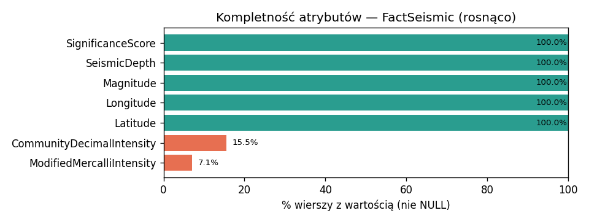
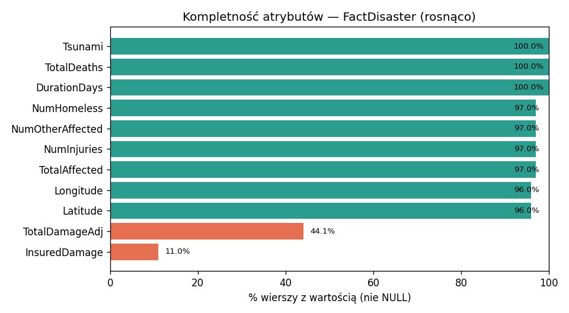
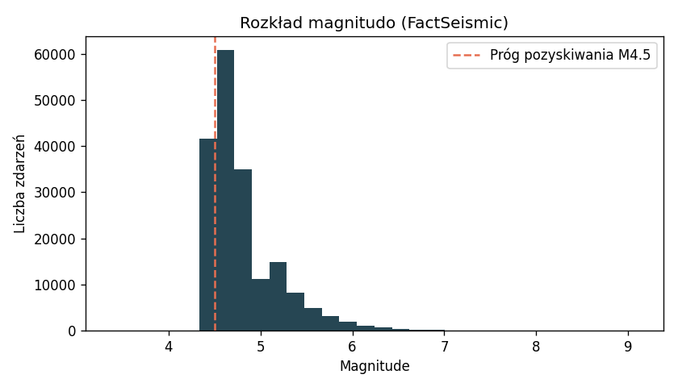
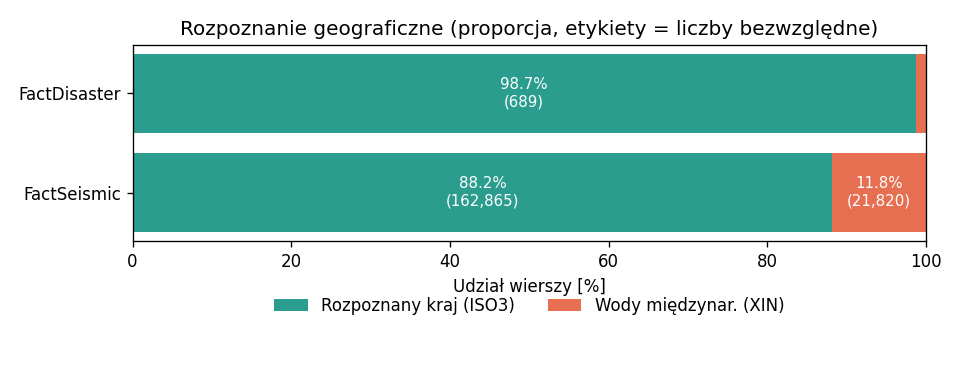
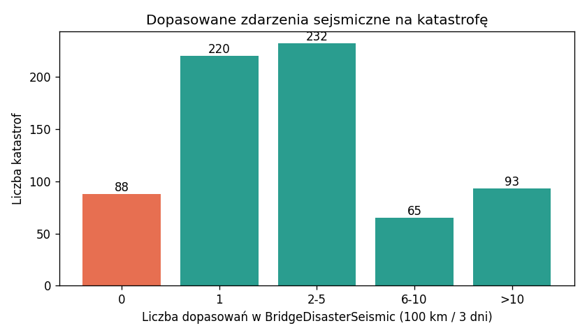
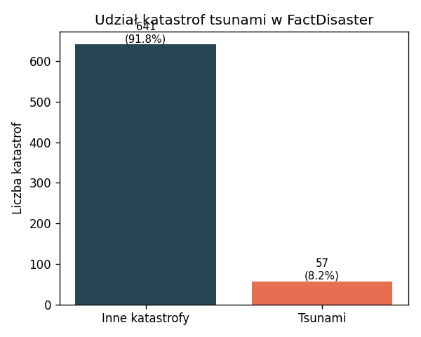
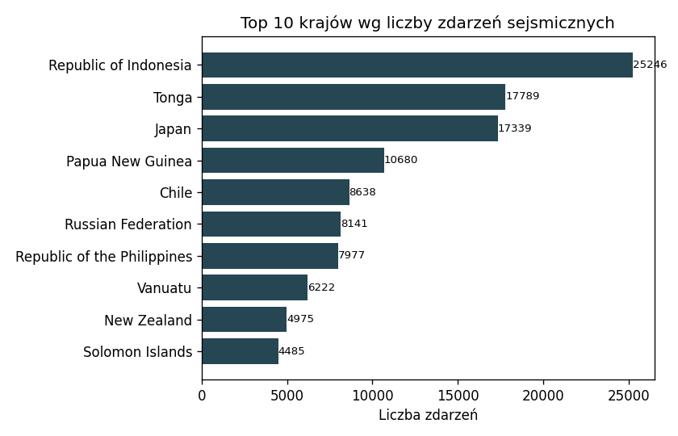
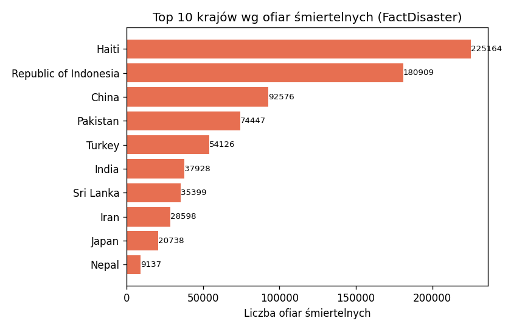

# Analiza jakości danych — SeismicDisasterDWH

Analiza obejmuje hurtownię `SeismicDisasterDWH` (warstwa prezentacji) oraz warstwę staging (`SeismicDisasterSTG`) na potrzeby kontroli unikalności. Dane sejsmiczne pochodzą z USGS, dane o katastrofach z EM-DAT.

**Pokrycie czasowe:** zdarzenia sejsmiczne 2000-01-01–2026-06-13, katastrofy 2000-01-02–2026-04-08.

## 1. Liczność tabel

| Tabela                |   Liczba wierszy |
|:----------------------|-----------------:|
| FactSeismic           |           184685 |
| FactDisaster          |              698 |
| BridgeDisasterSeismic |             4291 |
| DimGeography          |              143 |
| DimDate               |            14975 |
| DimMagnitude          |                8 |
| DimSeismicDepth       |                4 |
| DimSeverityDeaths     |                4 |
| DimSeverityAffected   |                4 |

## 2. Kompletność atrybutów

Dla każdej tabeli faktów wykres pokazuje % wierszy z wartością (nie NULL) dla każdej kolumny-atrybutu, sortowane rosnąco. Kolumny kluczy (surogatów, FK) i znaczniki audytowe (`InsertDate`/`UpdateDate`) są zawsze w 100% wypełnione z definicji, więc zostały wyłączone. Kolor: zielony ≥95%, pomarańczowy 50–95%, czerwony <50%.

### 2.1 FactSeismic

| Kolumna                   |   % wypełnienia |
|:--------------------------|----------------:|
| ModifiedMercalliIntensity |             7.1 |
| CommunityDecimalIntensity |            15.5 |
| Latitude                  |           100.0 |
| Longitude                 |           100.0 |
| Magnitude                 |           100.0 |
| SeismicDepth              |           100.0 |
| SignificanceScore         |           100.0 |

- Kolumny `ModifiedMercalliIntensity`, `SignificanceScore`, `CommunityDecimalIntensity` pochodzą z feedu **GeoJSON** USGS (od 06.2026 ekstraktor pobiera ten format zamiast CSV). `SignificanceScore` jest wyliczany przez USGS dla każdego zdarzenia (100%). `ModifiedMercalliIntensity` i `CommunityDecimalIntensity` pochodzą z systemu „Did You Feel It?” (zgłoszenia obywateli) i istnieją tylko dla zdarzeń odczuwalnych przez ludzi — niskie wypełnienie (7-16%) jest naturalną właściwością tych danych, nie błędem ETL.

### 2.2 FactDisaster

| Kolumna          |   % wypełnienia |
|:-----------------|----------------:|
| InsuredDamage    |            11.0 |
| TotalDamageAdj   |            44.1 |
| Latitude         |            96.0 |
| Longitude        |            96.0 |
| TotalAffected    |            97.0 |
| NumInjuries      |            97.0 |
| NumOtherAffected |            97.0 |
| NumHomeless      |            97.0 |
| DurationDays     |           100.0 |
| TotalDeaths      |           100.0 |
| Tsunami          |           100.0 |

- `TotalDamageAdj` i `InsuredDamage` mają niskie wypełnienie — to **naturalna rzadkość danych źródłowych** EM-DAT (dane finansowe raportowane tylko dla części katastrof), nie błąd ETL. Podobnie `NumHomeless`, `NumOtherAffected` i `NumInjuries` są raportowane tylko dla części zdarzeń.

## 3. Walidność (reguły zakresowe)

| Reguła | Liczba naruszeń | Wynik |
|---|---:|:--:|
| Magnitude w zakresie [0, 10] | 0 | ✅ PASS |
| Szerokość geogr. w [-90, 90] | 0 | ✅ PASS |
| Długość geogr. w [-180, 180] | 0 | ✅ PASS |
| EndDate >= StartDate (katastrofy) | 0 | ✅ PASS |
| TotalDeaths >= 0 | 0 | ✅ PASS |

Rozkład magnitudo zaczyna się od progu pozyskiwania M4.5 (filtr API USGS), co jest zgodne z założeniem projektu.

## 4. Spójność i integralność

### 4.1 Rozpoznanie geograficzne (ISO3 vs XIN)

Ok. 11.8% zdarzeń sejsmicznych (21,820 z 184,685) ma kod `XIN` (wody międzynarodowe). To **oczekiwane** — wiele trzęsień ziemi występuje na strefach subdukcji pod oceanami; reverse-geocoding przypisuje im umowny kod oceaniczny. Katastrofy EM-DAT są niemal w całości przypisane do krajów.

### 4.2 Pokrycie tabeli mostkowej

88 z 698 katastrof nie ma żadnego dopasowanego zdarzenia sejsmicznego w oknie 100 km / 3 dni. Wynika to z braku współrzędnych w części rekordów EM-DAT oraz z katastrof spoza zakresu magnitudo USGS (M≥4.5).

## 5. Unikalność i wykryte defekty

- Zduplikowane `EventId` w `STG_USGS_Raw`: **0**.

- Zduplikowane `DisNo` w `STG_EMDAT_Raw`: **0**.

**Wykryty i naprawiony defekt:** pierwotnie EM-DAT został załadowany dwukrotnie (przed dodaniem deduplikacji po `DisNo` w `extract_emdat.py`), co podwajało `FactDisaster` (1396 zamiast 698) i tabelę mostkową. Naprawiono skryptem `fix_emdat_duplication.sql`; ekstraktor obecnie deduplikuje rekordy przy wejściu do stagingu, więc defekt się nie powtórzy.

## 6. Profil danych — kontekst biznesowy

### 6.1 Udział katastrof tsunami

57 z 698 katastrof (8.2%) ma ustawioną flagę `Tsunami=1` — pozwala to wyodrębnić podzbiór katastrof tsunami, kluczowy dla tematu hurtowni, niezależnie od ogólnej analizy sejsmicznej.

### 6.2 Geografia zdarzeń sejsmicznych i ofiar

Kraje o najwyższej liczbie zarejestrowanych zdarzeń sejsmicznych M≥4.5 — zgodnie z oczekiwaniami dominują kraje leżące na granicach płyt tektonicznych (Pacyficzny Pierścień Ognia).

Kraje z największą sumą ofiar śmiertelnych w `FactDisaster` — istotny widok dla analizy ryzyka, często odmienny od rankingu samej liczby zdarzeń sejsmicznych (zależy od gęstości zaludnienia, infrastruktury i typu katastrofy).
